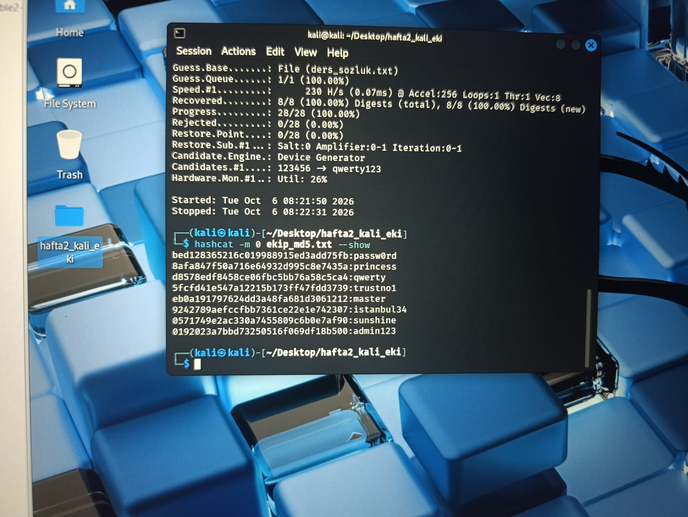
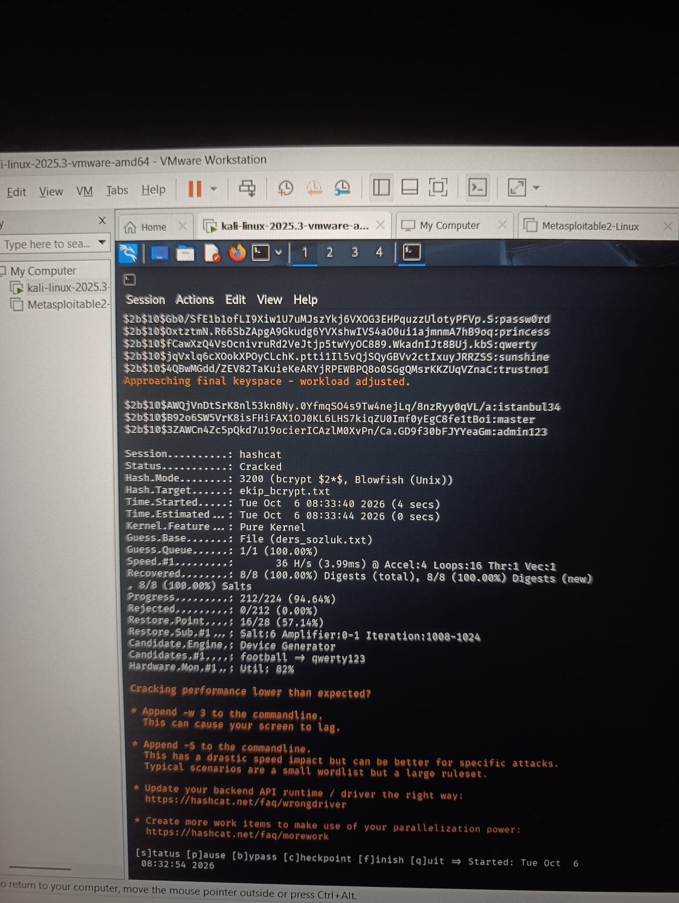

# Hafta 2 · Parola Kırma ve Özet Güvenliği Laboratuvarı

Bu rapor, Kali Linux ortamında hashcat aracı kullanılarak zayıf ve modern özet (hash) algoritmalarının kırma hızlarının, güvenlik seviyelerinin ve tuzlama mekanizmasının deneysel sonuçlarını içerir.

---

## 1. Ekran Görüntüleri

### Adım 1: Tuzsuz MD5 Kırma Sonucu
MD5 ile üretilen 8 özetin tamamı sözlük saldırısıyla anında kırılmıştır (8/8 %100).

### Adım 3: bcrypt Kırma Sonucu ve Yavaşlığı
bcrypt algoritmasının donanım direnci ve kırma anındaki belirgin yavaşlığı (36 H/s):

---

## 2. Adım 4: Hız Ölçüm Değerleri

Donanım üzerinde gerçekleştirilen testler sonucunda elde edilen kırma/deneme hızları:
* **MD5 Hızı:** 230 H/s (Küçük sözlükte anlık / <1 sn)
* **SHA-256 Hızı:** 44,287 H/s (~44.2 kH/s)
* **bcrypt Hızı:** 36 H/s (Donanım direnci nedeniyle saniyede sadece onlar seviyesinde)

---

## 3. Soruların Cevapları

### 1) Hangi özet anında kırıldı, hangisi yavaştı, neden?
* **MD5 ve SHA-256 anında kırıldı:** Bu algoritmalar genel veri bütünlüğünü (checksum) doğrulamak amacıyla olabildiğince hızlı çalışacak şekilde tasarlanmıştır. Donanım hızlandırmalarıyla çok yüksek işlem kapasitesine ulaşabildiklerinden, sözlükteki kelimelerle eşleşmeler anında tamamlanmıştır.
* **bcrypt çok yavaştı (36 H/s):** bcrypt, parola saklama amacıyla tasarlanmış bir anahtar türetme (Key Derivation) fonksiyonudur. İçerisinde maliyet faktörü (work factor / round sayısı) barındırır. CPU ve GPU üzerinde paralel işlem yapılmasını zorlaştırarak hashcat deneme hızını saniyede yalnızca 36 seviyesine düşürmüştür.

### 2) MD5 ile SHA-256 arasında kırma kolaylığı açısından fark var mıydı?
* **Saldırı kolaylığı açısından pratikte fark yoktu:** Kriptografik açıdan SHA-256 matematiksel çakışma (collision) direnci bakımından MD5'ten çok daha modern ve güvenlidir. Ancak parola saklama ve sözlük/kaba kuvvet saldırıları söz konusu olduğunda, SHA-256 da tek başına aşırı hızlı hesaplandığı için MD5 gibi saniyeler içinde kırılmıştır. Bu nedenle tuzsuz SHA-256 da parola saklama için tek başına yetersizdir.

### 3) bcrypt neden hem kullanıcı için sorun değil hem saldırgan için kâbus?
* **Kullanıcı için sorun değildir:** Bir kullanıcı sisteme giriş yaparken bcrypt özetinin hesaplanması yaklaşık 100–300 ms sürer. Tek bir oturum açma işleminde saniyenin üçte biri kadar beklemek insan algısında hissedilmez ve kullanıcı deneyimini olumsuz etkilemez.
* **Saldırgan için kâbustur:** Bir saldırgan ele geçirdiği hash'i çözebilmek için milyarlarca parolayı denemek zorundadır. Saniyede milyarlarca işlem yapmak yerine saniyede yalnızca 36 deneme yapabilmesi, saldırının aylar veya yüzyıllar sürmesine neden olarak kaba kuvvet saldırısını imkânsız kılar.

### 4) 'Tuz' (salt) ne işe yarar?
* **Rainbow Table saldırılarını engeller:** Parolanın yanına eklenen rastgele karakter dizisi (tuz) sayesinde, saldırganların önceden hesapladığı devasa hazır özet tabloları (Rainbow Tables) işe yaramaz hale gelir.
* **Aynı parolayı kullanan hesapların özetlerini farklılaştırır:** İki farklı kullanıcı aynı parolayı (örneğin 123456) seçse dahi, her birine atanan tuz farklı olduğu için veritabanında saklanan özetler tamamen farklı görünür. Böylece tek bir özet kırıldığında aynı parolayı kullanan diğer hesaplar açığa çıkmaz.
